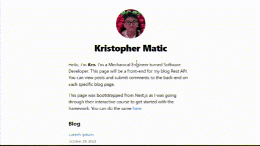

# Blog front-end for [Blog Rest API](https://github.com/kmatic/blog-api)

Blog front end built with React framework Next.js. View the demo [here](https://blog-front-end-opal.vercel.app/)

Blog API [here](https://github.com/kmatic/blog-api)

Blog management app TODO.

## Preview

## Built With

- React
- Next.js

## Reflection

This is a simple web app that I created while following through an interactive tutorial on the next.js website. Upon completion, I modified the app to incorporate the Blog Rest API I created to instead display blog posts and comments from a mongoDB database. 